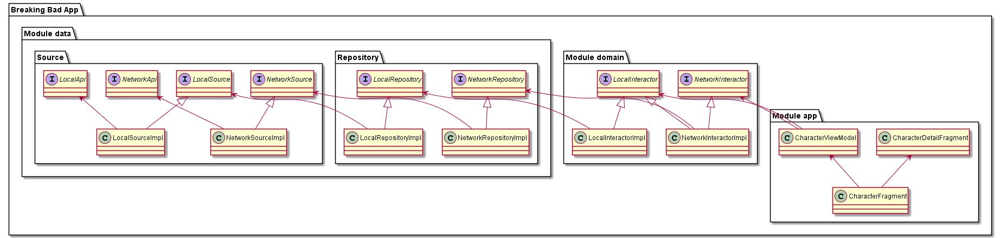
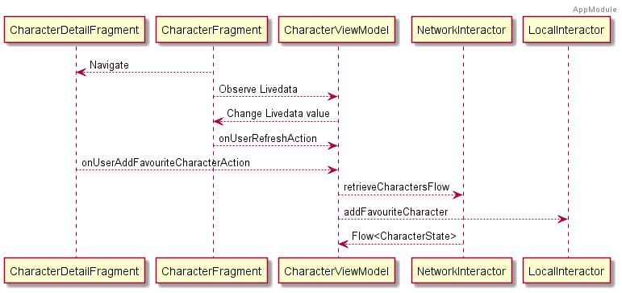
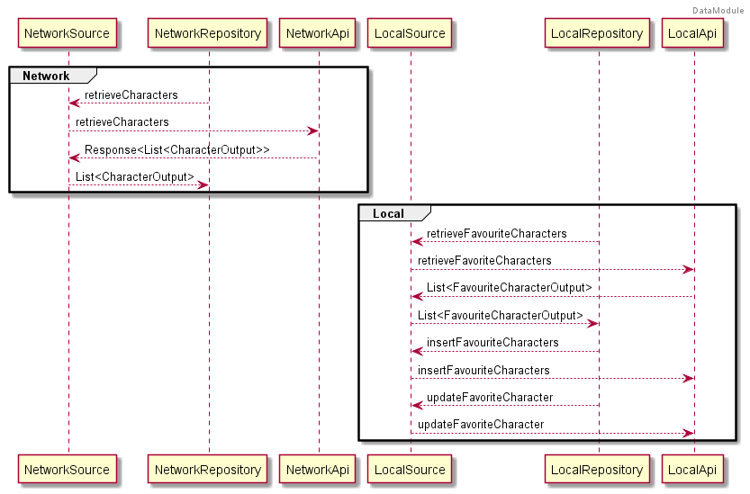
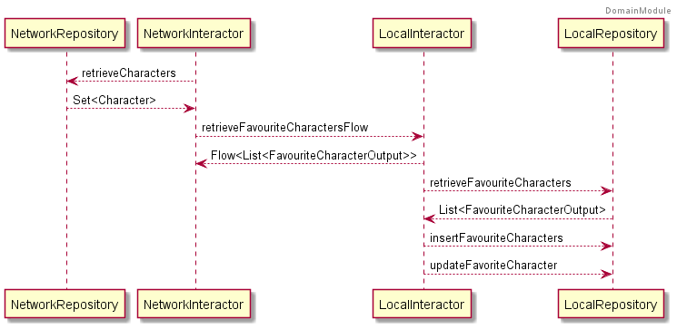

### Main Features
We have different components in this project in different modules all of them with a dependency injection (Hilt):

* App Module: This module has the ui
  * There are two fragments, CharacterFragment and CharacterDetailFragment.
  The first, observes a view model, which retrieve a list of characters through a live data that contain a state that let us have a good control of different                                    states which can set a successful state, or Failure.
  When user select a character a bottom dialog will be displayed with more details about character. Glide is used to display images and with a extensions function    will show the status of the character with a image.
  Then CharacterFragment or CharacterDetailFragment will respond in each case.

  * Our CharacterViewModel will call instructor class which will retrieve a list of characters and through the state will notify the new state.
  Also, using a stateFlow, we'll can interact/respond to user actions for refresh the list or add a new character as a favourite in local database

  * CharacterFragment have a ConcatAdapter that has a Header Adapter with a Adapter(ListAdapter) that use a AdapterDiffCallback.

* Core Module: This module has the core classes, objects or things, shared with the rest of the app
  * This module has the base class of the Fragments and Activities.

* Domain Module: This module has the interactors
  * This module has the interactor which retrieves or interact with a localDatabase or an Api and the models.
  The logic of NetWorkInteractor apart that to retrieve a list of characters of an API, is listening a userActionStateFlow for each value and also retrieve a list of favouritecharacters from a local database, that combine with a list of characters and assign if the character is marked as favourite or not.
  Besides, is able to catch the different app exceptions.

* Data Module: This module has the repositories, entities, or sources.
  * This module has the repositories that retrieve data (characters) from a source.
  A source that can use a network Api (retrofit) or a local database(room).
  Also, there are a list of custom app exceptions and a function to call network Api. This have a function that return a generic response as parameter, that inside a try/catch,will invoke a function as parameter and return the response is if successful or throw a exception.

For understand better how the application is structured and his logic, there are different diagrams, one of classes and other of sequence for each module:

**Class Diagram**

**Sequence App Diagram**

**Sequence Domain Diagram**

**Sequence Data Diagram**

Finally, there are a different types of tests inside Domain Module(Unit/Integration) and Data Module. The most complex test is the unit tests for check the correct work of room and retrofit